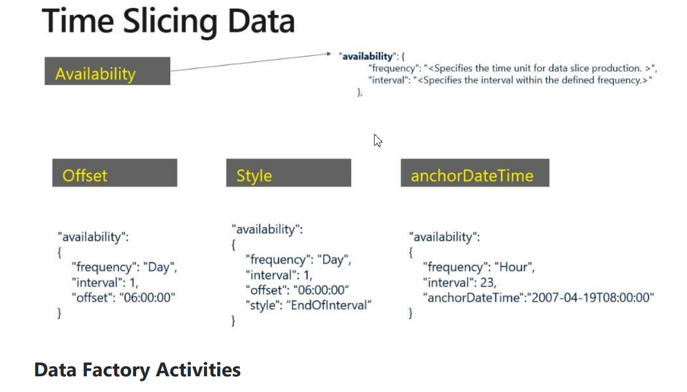
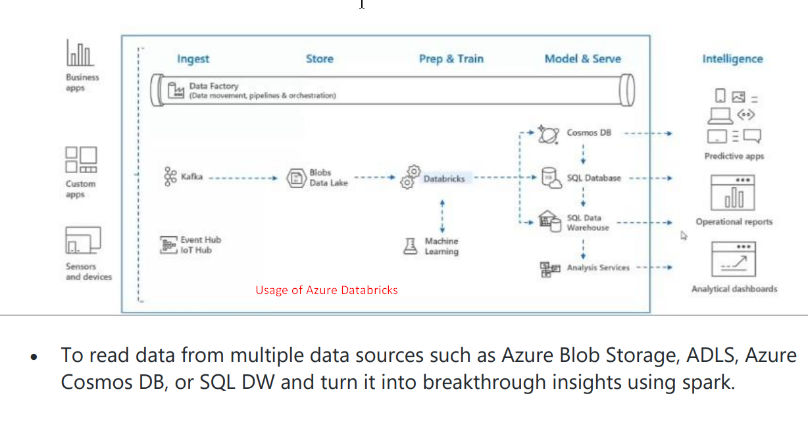
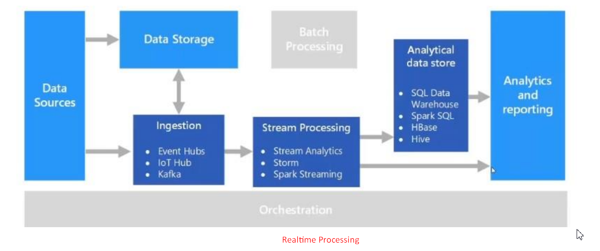
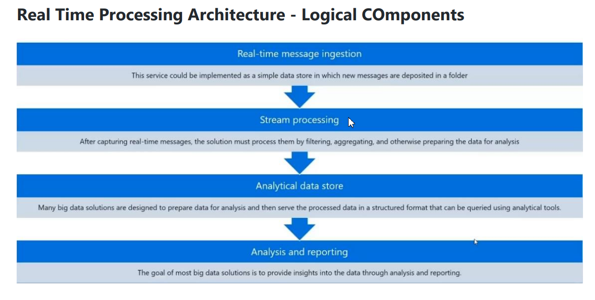
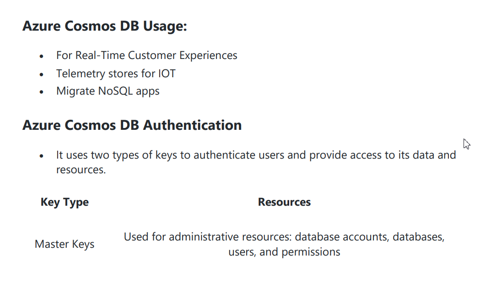

# DP-203

# UPSKILL

# Star Architecture

# Question

# Dimension, Factor, Staging

# Star Architecture

# Star Architecture

# Question

# Question

# No-Clustered index structure

# ACID

# Stream Analytics

# IOT

# Stream Analytics

# IOT

# IOT Hub, Azure Function

# Prediction, Prescription, diagnostic, Description

# Azure Synapse Analytics

# Azure Synapse Analytics

# Azure Synapse Analytics

# Spark Nod

# Azure Synapse Link

# CosmosDB

# Kubernetes

# IOT

# Contenedor

# Storage

# Analytics

# Real Time

# Azure Stream Analytics

# Pipeline

# Pipeline Stream

# Integration Runtime Setup

# Integration Runtime

# Views, Acess, Consistency, Caching, Design, Issue, Indexes

# SPARK - Transfer data

# SPARK - JDBC

# SPARK - Polybase

# Dedicate SQL Pool

# Authentication

# T-SQL Statement

# Azure data store service

# Azure Storage Account

# Batch

# Synapse API

# Table Description

# Compressed Columnstore

# SQL DW

# Loggin Bulk Load

# TCP, UDP, TCP

# Modern Data Warehouse

# Star Architecture

# Query Performance

# Clustered, Non-Clustered, Clustered columsstore

# Read Committed Shapshot

# Caching

# Authentication

# Row Store vs Column store

# Clustering Indexes

# Columnstore

# Indexes

# Azure Synapse Analytics

# ETL x ELT

# Single Gated

# Parallel - Data Loading

# Single Gated

# Parallel Data Loading

# SQL VS NoSQL

# SQL

# Database

# AirFlow Data

# Windows - Stream Analytics

# Tumbling Windows - Caindo ( second, 10)

# Hopping Windows - Saltando (second, 10, 5)

# Sliding Windows - Deslizante (second, 10)

# Session Windows - Sessao (second, 5, 10)

# Snapshot Windows - (System.Timestamp)

# Type 1 SCD

# Type 2 SCD

# Type 3 SCD

# Type 4 SCD

# Data Factory

# Data Factory

# Integration runtime

# Integration runtime types

# MLOPS

# Unlike Hadoop external tables, native external tables don't return subfolders

# SQL

# Cloud Comparasion

# MySQL JOIN

# Modern Data Stack

# SCD

# Fact, Dimension, Staging

# Data Factory

# Data Engineering

# OLAP

# Apache Spark x Apache AirFlow

# Pinot

# Data Lake , Data Whaerhouser, Data Marts, Architecture.

# Azure Active Directory

# Question

# Capture events through Azure Event Hubs in Azure Blob Storage or Azure Data Lake Storage

# Big data architecture style

# The holistic workflow:

# Azure Storage

# Subscription Organization
Configurações da conta de armazenamento
Uma conta de armazenamento define uma política que se aplica a todos os serviços de armazenamento na conta. Por exemplo, você pode especificar que todos os serviços contidos serão armazenados no datacenter do Oeste dos EUA, acessíveis somente por HTTPS e cobrados na assinatura do departamento de vendas.

As configurações definidas por uma conta de armazenamento são:

Assinatura: a assinatura do Azure que será cobrada pelos serviços na conta.

Localização: o datacenter que armazenará os serviços na conta.

Desempenho: determina os serviços de dados que você pode ter em sua conta de armazenamento e o tipo de discos de hardware usados para armazenar os dados.

Standard permite que você tenha qualquer serviço de dados (Blob, Arquivo, Fila, Tabela) e use unidades de disco magnéticas.
O Premium oferece mais serviços para armazenar dados. É possível, por exemplo, armazenar dados de objeto não estruturado, como blobs de blocos ou blobs de acréscimo, e armazenamento de arquivos especializado usado para armazenar e criar compartilhamentos de arquivos premium. Essas contas de armazenamento usam SSDs (unidades de estado sólido) para armazenamento.
Replicação: Determina a estratégia usada para fazer cópias dos dados para se proteger contra falhas de hardware ou desastres naturais. No mínimo, o Azure mantém automaticamente três cópias dos dados no datacenter associado à conta de armazenamento. A replicação mínima é chamada de LRS (armazenamento com redundância local) e oferece proteção contra falhas de hardware, mas não contra eventos que prejudicam o datacenter inteiro. Você pode atualizar para uma das outras opções, como o GRS (armazenamento com redundância geográfica), para obter a replicação em datacenters diferentes no mundo.

Camada de acesso: controla a rapidez com que você poderá acessar os blobs em uma conta de armazenamento. A camada de armazenamento frequente proporciona acesso mais rápido do que a camada de armazenamento esporádico, mas com um aumento de custo. A camada de acesso quente se aplica somente a blobs e representa o valor padrão para novos blobs.

Transferência segura obrigatória: um recurso de segurança que determina os protocolos compatíveis para acesso. A opção Habilitado exige HTTPS, enquanto a opção Desabilitado permite HTTP.

Redes virtuais: um recurso de segurança que permite solicitações de acesso de entrada apenas das redes virtuais especificadas.

# Databases

# Obtención e integración de los datos
# Conservación de los datos
# Evaluación y análisis de los datos

# Recolección
# Almacenamiento y conservación
# Entrega (para su consulta)

# La tabla de hechos contiene los índices y las métricas sobre los eventos de una empresa que se deben registrar de forma continua (el volumen de ventas, por ejemplo).
# Las tablas de dimensiones contienen atributos que describen los datos de la tabla de hechos. Se trata así de un conjunto de datos de referencia para los eventos registrados en la tabla de hechos.

# Snowflake Schema

# OLAP 

# Slicing: se conoce como slicing el procedimiento por el cual se delimita una dimensión del cubo OLAP por una porción cuantitativa, prácticamente como si se cortara un “trozo” de datos y se estudiara por separado.

# Dicing: cuando se interviene en un cubo OLAP con varias operaciones de slicing simultáneas en varias dimensiones se habla de dicing, porque se crea un cubo nuevo más reducido que contiene una porción del cubo global.

# Pivoting: este hace referencia al método de girar un cubo de datos de forma que se visualice, al menos, otra dimensión.

# Drill down/Roll up: cuando las variables de un objeto se deben desglosar a valores aún más detallados se utiliza la operación drill down, que permite a los analistas ampliar una sección del cubo OLAP para aumentar su grado de detalle. La operación inversa se denomina roll up y en ella se compacta la información a niveles más altos de la jerarquía. Ambos se utilizan en la navegación en estructuras jerárquicas multidimensionales.

# Tool

# Tool

# Infra

# Data Stack

# SQL RoadMap

# ETL / ELT

# ETL / ELT

# ETL / ELT

# ETL / ELT

# Stream

FIM